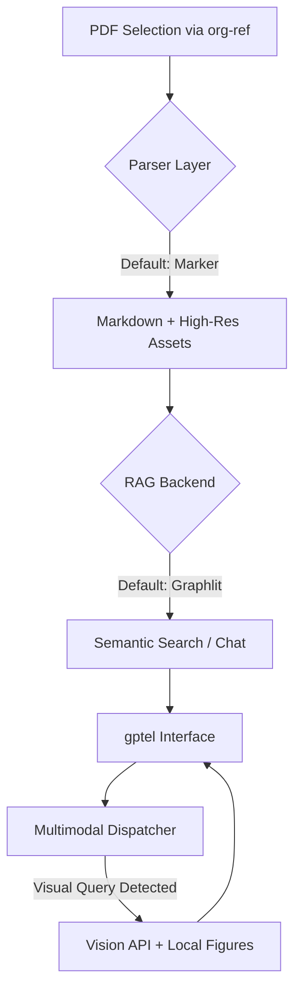

# Fuji (负笈) - Your Digital Library

[](https://opensource.org/licenses/MIT)

**Nexus-Paper** is a high-fidelity, multimodal research assistant integrated directly into Emacs. It bridges the gap between static PDFs and intelligent AI interaction by orchestrating state-of-the-art parsing, semantic RAG, and multimodal vision analysis.

---

## 🚀 The Vision

Reading academic papers should feel like a conversation, not a chore. Nexus-Paper transforms your local PDF library into a living knowledge base where:

- **Text** is parsed with high fidelity (formulas, tables, and structures preserved).
- **Figures** are not just seen, but understood in context.
- **Insights** are retrieved instantly using modern RAG techniques.
- **Workflow** is seamless, leveraging your existing `org-ref` and `gptel` setup.

## 🏗️ Architecture

Nexus-Paper is built on a **Pluggable Provider Architecture**, ensuring that as the AI landscape evolves, your tools can evolve with it.



## 🌟 Key Features

- **High-Fidelity Parsing**: Integration with [Marker](https://github.com/VikParuchuri/marker) for converting complex PDFs into structured Markdown with extracted figures.
- **Intelligent RAG**: Seamless integration with [Graphlit](https://www.graphlit.com/) for cloud-based Retrieval-Augmented Generation.
- **Multi-Brain Dispatcher**: An intelligent orchestration layer that routes visual queries (e.g., "Explain Figure 3") to multimodal models while providing them with textual context from the RAG backend.
- **Programmatic Orchestration**: Automatically configures `gptel` settings (models, backends, system prompts) based on the session context.
- **Privacy-Conscious Cleanup**: Just-in-time uploads with persistent local caching and automatic cleanup of cloud data.

## 🛠️ Prerequisites

- **Emacs 29+**
- **Marker**: Installed in a local Python environment.
  > [!IMPORTANT]
  > First-time use of Marker requires downloading models (~数GB), which can take a long time and significant bandwidth. It is highly recommended to run Marker at least once from the terminal (`marker /path/to/any.pdf --output_dir /tmp/test`) to ensure models are cached before using it within Emacs.
- **Google Chrome / Chromium**: Required for Web Document support (Headless mode).
  > [!TIP]
  > Fuji can auto-detect your Chrome installation, or you can specify the path in `fuji-configure`.
- **Graphlit Account**: API Organization ID and Secret.
- **gptel**: For the LLM frontend.
- **org-ref / citar**: For literature management.

## 📦 Installation & Setup

1. Clone the repository.
2. Add to your `load-path` and `(require 'fuji)`.
3. **First-time Setup**: Run `M-x fuji-configure` to set your Marker path and Bibliography directory. These settings will be saved to your Emacs custom file.
4. **Credentials**: Ensure your Graphlit Organization ID and Secret are in your `~/.authinfo` or `~/.authinfo.gpg`:

    ```text
    machine graphlit login YOUR_ORG_ID password YOUR_SECRET
    ```

## ⚖️ License

Distributed under the **MIT License**. See `LICENSE` for more information.
