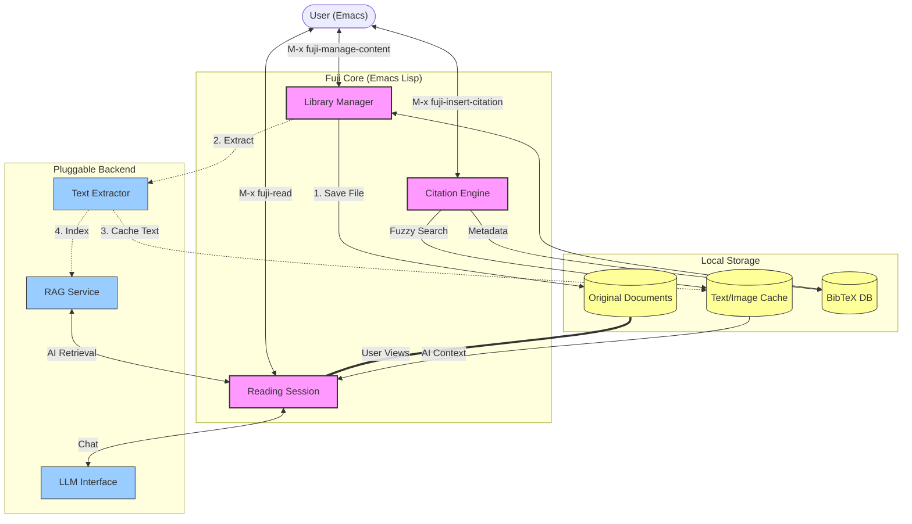

# 🗻 Fuji (Fùjí)

[](https://opensource.org/licenses/MIT)

**Fuji (负笈)** is your **Personal Digital Library** and intelligent reading assistant, natively integrated into Emacs. 
While it started as a tool for reading academic papers, it has evolved into a comprehensive system for managing and interacting with your entire digital knowledge base—whether it's papers, novels, technical books, personal notes, or **Web URLs** (which are automatically downloaded and preserved as PDFs).

---

## 📖 The Name "Fùjí"

The name is a double entendre bridging Eastern heritage and modern aspiration:

1.  **Fùjí (负笈)**: A classical Chinese idiom meaning *"to travel with a book box on one's back to seek knowledge."* It symbolizes the scholar's lifelong journey of accumulating wisdom. Fuji is that digital "book box"—holding your entire library, always with you.
2.  **Mount Fuji (富士山)**: Sharing the pronunciation, it represents the "mountain of papers" researchers face, and the high vantage point this tool provides.

---

## � Why Fuji?

Fuji fills a unique niche by combining the strengths of traditional library managers with cutting-edge AI:

| Feature | Calibre | NotebookLM | **Fuji** |
| :--- | :--- | :--- | :--- |
| **Core Function** | E-book Management | AI Note-taking | **AI-Native Digital Library** |
| **Management** | ✅ Excellent | ❌ Limited | **✅ Powerful (Tagging, Search)** |
| **Reading** | ✅ Standard Reader | ✅ Summaries | **✅ AI-Assisted Deep Reading** |
| **AI Interaction** | ❌ None | ✅ Chat w/ Sources | **✅ Chat w/ Library (RAG)** |
| **Platform** | GUI App | Web App | **Emacs (Text-Centric)** |

### What Makes Fuji Unique?

1.  **Academic & Research First**: Unlike general readers, Fuji is optimized for researchers. Manage BibTeX automatically, chat to understand complex papers, and seamlessly insert citations while you write.
2.  **Your Personal Knowledge Base**: As you add documents, Fuji grows smarter. It doesn't just read one file; it understands your entire library. You can chat with your knowledge base to synthesize ideas across papers, novels, and notes.
3.  **Emacs Native (The Power of Text)**:
    *   **Universal Text Engine**: Whether source files are PDFs, DOCX, EPUB, or images, Fuji converts them to pure text for AI processing. This makes interaction fast, lightweight, and flexible.
    *   **Keyboard Driven**: Manage thousands of documents with simple, efficient Emacs keybindings.
    *   **Pluggable Architecture**: Completely modular. Swap out text extractors (Marker, PyMuPDF), RAG backends (Graphlit, local vector DB), or LLM providers (OpenAI, Claude, DeepSeek via `gptel`) at will.

---

## 🏗️ System Architecture

Fuji is designed as a modular, local-first system that orchestrates external AI services through Emacs.



*   **Core**: The Emacs Lisp layer handles UI, workflow logic, and state management.
*   **Storage**: 
    *   **Originals**: Your actual files (PDF/DOCX) are stored safely (e.g., `~/.fuji/originals/`).
    *   **Cache**: Fuji processes text once and caches it (in hash-based folders) for efficient AI interaction.
*   **Pluggable Backend**:
    *   **Extractor**: Defaults to `marker` (AI-powered) or `pdftotext`. Also supports `pandoc` (for DOCX/EPUB) and `chromium` (for Web URLs).
    *   **RAG**: Currently supports `Graphlit`; local vector support planned.
    *   **LLM**: Connects to OpenAI, Anthropic, Gemini, DeepSeek, etc., via `gptel`.

### 📂 Data Structure

Fuji keeps your data local and organized in `~/.emacs.d/fuji-cache/` (configurable):

```text

.
├── originals/           # Your actual library (PDFs, EPUBs) - Synced here
├── <SHA256-HASH>/       # Cached text & images for File A (e.g., "a1b2...")
├── <SHA256-HASH>/       # Cached text & images for File B
├── sessions/            # Chat history (saved as .org files)
└── metadata.json        # The database (fast lookup index)
```

> **🌍 Portable & Cloud-Ready**: Because Fuji is purely file and text-based (no complex databases), your library is **100% portable**. You can place this directory in **Dropbox, iCloud, Google Drive, or a home server**.
>
> Simply point `fuji-cache-directory` to this location on any machine, and your entire knowledge base—original files, AI context, chat history, and metadata—is instantly restored. **Zero lock-in, seamless sharing.**

---

## 🔄 The 4-Pillar Workflow

Fuji streamlines your entire knowledge lifecycle through four integrated workflows:

### 1. Document Management 🗂️
Turn existing folders into a structured library.
*   **Ingest Anything**: Add PDF, DOCX, XLSX, EPUB, Image files, or **Web URLs** (auto-converted to PDF for permanent archiving).
*   **Organize**: Edit titles, tags, and metadata instantly.
*   **BibTeX Sync**: Automatically generating and managing BibTeX entries for academic papers.
*   **Search**: Retrieve documents in milliseconds using fuzzy search or tag filtering.

### 2. Intelligent Reading 🧠
Deep reading with an AI copilot.
*   **Instant Access**: Open any document from your library with a few keystrokes.
*   **Contextual Chat**: Chat with the document side-by-side. Ask for summaries, clarification on formulas, or connections to other work.
*   **Persistent Memory**: All conversations are saved. Resume your dialogue with a paper months later without losing context.
*   **Anywhere Access**: Launch reading mode on *any* file in Emacs, even outside the library.

### 3. Unified Citation (Exciting!) ✍️
Write efficiently without breaking flow.
*   **Full-Text Citation Search**: When writing in Org-mode or LaTeX, search for citations not just by title/author, but by **content**.
*   **Fuzzy Matching**: Remember a concept but forgot the paper? Type a keyword, and Fuji finds the source and inserts the correct BibTeX key (`[cite:@key]`).

### 4. Knowledge Base Chat 💬
Conversation with your digital "Book Box".
*   **Synthesis**: Don't just talk to one book. Talk to your library. "What do my saved papers say about Transformer architectures?"
*   **Personalized AI**: The more you store, the better it understands your specific background and interests, providing increasingly tailored answers.

---

## 🛠️ Installation & Setup

Please refer to [SETUP.md](./SETUP.md) for detailed installation instructions and [usage_guide.md](./usage_guide.md) for a step-by-step walkthrough.

---

*Fuji is capable of connecting to almost any LLM in the world via `gptel`, ensuring your "Book Box" is always powered by the smartest minds.*
