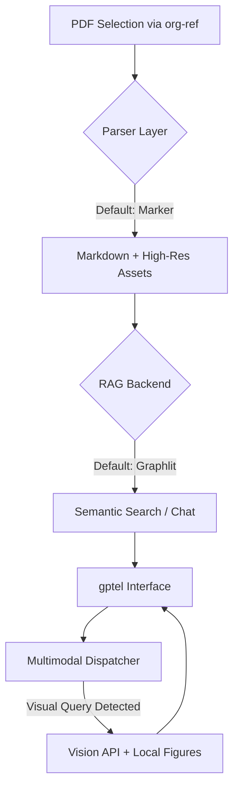

# Fuji (负笈) - 您的数字藏书阁

[](https://opensource.org/licenses/MIT)

**Fuji (负笈)** 是一款直接集成于 Emacs 的高保真、多模态研读助手。它通过编排最先进的解析技术、语义 RAG（检索增强生成）和多模态视觉分析，弥合了静态 PDF 与智能 AI 交互之间的鸿沟。

---

## 🚀 愿景

阅读学术论文应该像是一场对话，而不是一种负担。Fuji 将您的本地 PDF 库转化为一个鲜活的知识库，在这里：

- **文本** 被高保真解析（保留公式、表格和结构）。
- **图表** 不仅被看见，更能被结合上下文理解。
- **洞察** 通过现代 RAG 技术即时获取。
- **工作流** 无缝衔接，利用您现有的 `org-ref` 和 `gptel` 配置。

## 🏗️ 架构

Fuji 基于 **可插拔提供者架构 (Pluggable Provider Architecture)** 构建，确保随着 AI 领域的发展，您的工具也能随之进化。



## 🌟 核心特性

- **高保真解析**: 集成 [Marker](https://github.com/VikParuchuri/marker)，将复杂的 PDF 转换为结构化的 Markdown 并提取图表。
- **智能 RAG**: 与 [Graphlit](https://www.graphlit.com/) 无缝集成，实现基于云端的检索增强生成。
- **多脑调度器**: 一个智能编排层，能够将视觉查询（例如“解释图 3”）路由至多模态模型，同时从 RAG 后端提供文本上下文。
- **编程化编排**: 根据会话上下文自动配置 `gptel` 设置（模型、后端、系统提示词）。
- **隐私感知的清理**: 仅在需要时上传，支持持久化本地缓存和云端数据的自动清理。

## 🛠️ 前置要求

- **Emacs 29+**
- **Marker**: 在本地 Python 环境中安装。
  > [!IMPORTANT]
  > 首次使用 Marker 需要下载模型（约数 GB），这可能需要较长时间和大量带宽。强烈建议先在终端运行一次 Marker (`marker /path/to/any.pdf --output_dir /tmp/test`)，以确保在 Emacs 中使用前模型已缓存就绪。
- **Google Chrome / Chromium**: Web 文档支持所需（无头模式）。
  > [!TIP]
  > Fuji 可以自动检测您的 Chrome 安装，或者您可以在 `fuji-configure` 中指定路径。
- **Graphlit 账户**: 需要 API 多织 ID (Organization ID) 和 Secret。
- **gptel**: 用于 LLM 前端。
- **org-ref / citar**: 用于文献管理。

## 📦 安装与设置

1. 克隆本仓库。
2. 将其添加到您的 `load-path` 并 `(require 'fuji)`.
3. **首次设置**: 运行 `M-x fuji-configure` 设置您的 Marker 路径和参考文献目录。这些设置将保存到您的 Emacs custom 文件中。
4. **凭据**: 确保您的 Graphlit Organization ID 和 Secret 已配置在 `~/.authinfo` 或 `~/.authinfo.gpg` 中：

    ```text
    machine graphlit login YOUR_ORG_ID password YOUR_SECRET
    ```

## ⚖️ 许可证

基于 **MIT License** 分发。详见 `LICENSE` 文件。
